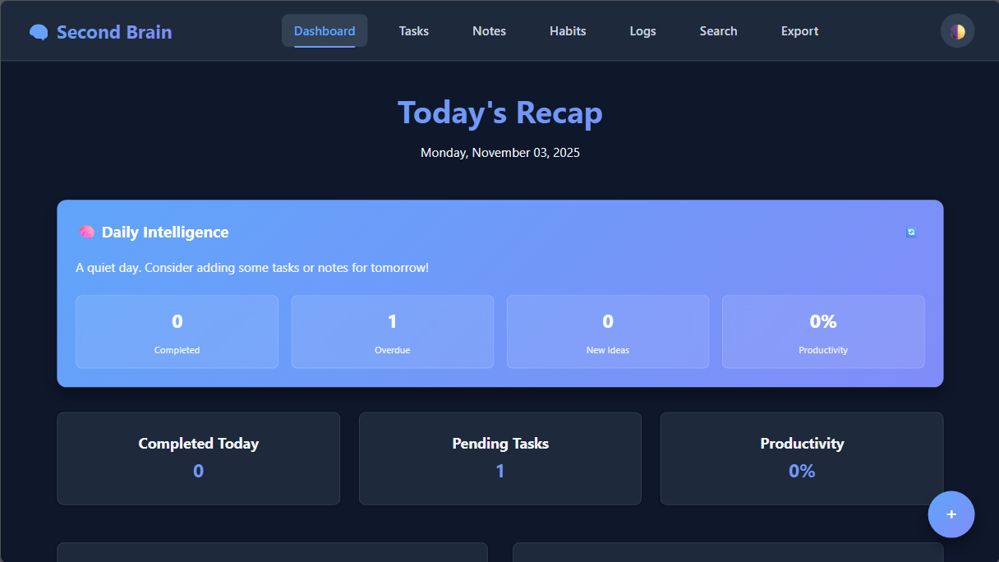

# Axon - Personal Memory & Productivity App



A comprehensive personal productivity application that serves as your digital memory assistant. Track tasks, notes, habits, and daily logs in one beautifully designed interface.

## Features

### Core Functionality
- **Task Management** - Create, organize, and track tasks with due dates
- **Smart Notes** - Capture ideas with tagging and search capabilities
- **Habit Tracker** - Build routines with streak tracking and completion history
- **Daily Logs** - Reflect on accomplishments, missed items, and tomorrow's plans
- **Universal Search** - Find anything across all your content instantly

### User Experience
- **Dark/Light Theme** - Toggle between beautiful color schemes
- **Responsive Design** - Works perfectly on desktop, tablet, and mobile
- **PWA Support** - Install as a native app on any device
- **Offline Capability** - Access your data even without internet
- **Smart Daily Recap** - AI-powered daily summaries and productivity insights

### Technical Features
- **Data Export** - Backup your data in CSV or JSON format
- **RESTful API** - Complete API for all operations
- **Real-time Updates** - Instant synchronization across all components
- **Keyboard Shortcuts** - Power user navigation and quick actions

## Quick Start

### Prerequisites
- Python 3.8+
- Modern web browser
- (Optional) SQLite for database

### Installation

1. **Clone the repository**
   ```bash
   git clone https://github.com/yourusername/second-brain.git
   cd second-brain
   ```

2. **Install dependencies**
   ```bash
   pip install -r requirements.txt
   ```

3. **Initialize the database**
   ```bash
   python database/init_db.py
   ```

4. **Run the application**
   ```bash
   python app.py
   ```

5. **Access the app**
   Open your browser and navigate to `http://localhost:5000`

### Docker Deployment
```bash
# Using Docker Compose
docker-compose up -d

# Or build manually
docker build -t second-brain .
docker run -p 5000:5000 second-brain
```

## 🛠️ Development

### Project Structure
```
second_brain/
├── app.py                 # Main Flask application
├── database/
│   ├── init_db.py        # Database initialization
│   └── schema.sql        # Database schema
├── templates/            # HTML templates
├── static/
│   ├── css/             # Stylesheets
│   ├── js/              # Frontend JavaScript
│   └── icons/           # App icons
├── config.py            # Configuration settings
└── requirements.txt     # Python dependencies
```

### Technology Stack
- **Backend**: Flask, SQLAlchemy, SQLite
- **Frontend**: Vanilla JavaScript, CSS3, HTML5
- **Database**: SQLite (with PostgreSQL support ready)
- **Deployment**: Docker, Waitress, Gunicorn
- **PWA**: Service Workers, Web App Manifest

### API Documentation

#### Tasks
```http
GET    /api/tasks                 # List all tasks
POST   /api/tasks                 # Create new task
PUT    /api/tasks/{id}           # Update task
DELETE /api/tasks/{id}           # Delete task
```

#### Notes
```http
GET    /api/notes                 # List all notes  
POST   /api/notes                 # Create new note
PUT    /api/notes/{id}           # Update note
DELETE /api/notes/{id}           # Delete note
```

#### Habits
```http
GET    /api/habits                # List all habits
POST   /api/habits/{id}/complete  # Mark habit complete
POST   /api/habits/{id}/skip      # Skip habit for today
```

#### Daily Logs
```http
GET    /api/logs/today           # Get today's log
POST   /api/logs                 # Create today's log
PUT    /api/logs/{id}           # Update log
DELETE /api/logs/{id}           # Delete log
```

### Environment Variables
```bash
SECRET_KEY=your-secret-key-here
DATABASE_URL=sqlite:///second_brain.db
FLASK_ENV=development
PORT=5000
```

## Customization

### Color Themes
The app uses CSS custom properties for easy theming. Edit `static/css/style.css`:

```css
:root {
    --primary-bg: #9ECFD4;
    --secondary-bg: #70B2B2;
    --accent-primary: #016B61;
    /* Add your custom colors */
}
```

### Adding New Features
1. Create database model in `app.py`
2. Add API routes following REST conventions
3. Create frontend JavaScript module
4. Add template if needed
5. Update navigation in `base.html`

## PWA Features

### Installation
- **Chrome**: Click install button in address bar
- **Safari**: Share → Add to Home Screen
- **Firefox**: Menu → Install

### Offline Usage
The app caches essential resources and works offline. Your data syncs when connection is restored.

## Data & Privacy

### Data Storage
- All data stored locally in SQLite database
- Optional cloud sync can be implemented
- Full export capabilities for data portability

### Backup
- Regular CSV/JSON exports recommended
- Database file backed up in `data/` directory
- No external data sharing

## Deployment

### Production Setup
```bash
# Using production server
python production.py

# Using Gunicorn (Linux/Mac)
gunicorn -c gunicorn.conf.py app:app

# Using Waitress (Windows)
waitress-serve --port=5000 app:app
```

### Deployment Options
- **Traditional VPS**: Use provided deployment scripts
- **Docker**: Use docker-compose for full stack
- **Cloud Platforms**: Ready for Heroku, Railway, etc.
- **Static Hosting**: Can be adapted for static deployment 

### Development Setup
1. Fork the repository
2. Create a feature branch
3. Make your changes
4. Add tests if applicable
5. Submit a pull request

### Code Style
- Follow PEP 8 for Python code
- Use meaningful variable names
- Comment complex logic
- Update documentation for new features

## Performance

- **First Load**: < 2 seconds
- **Database Queries**: Optimized with indexes
- **Frontend**: Vanilla JS for minimal bundle size
- **Caching**: Service worker for static assets

## Troubleshooting

### Common Issues

**Database errors:**
```bash
python database/init_db.py
```

**Port already in use:**
```bash
python app.py --port 5001
```

**Static files not loading:**
- Check file permissions
- Verify file paths in templates
- Clear browser cache

### Getting Help
- Check existing [GitHub Issues](../../issues)
- Create a new issue with detailed description
- Include browser console errors if applicable

## Acknowledgments

- Inspired by personal knowledge management systems
- Built with Flask and modern web standards
- Icons from Twemoji and custom designs
- Color palette designed for accessibility

```

This README provides:

1. **Professional presentation** with badges and screenshots
2. **Comprehensive feature overview** 
3. **Easy installation instructions** for different environments
4. **Developer documentation** with API specs and code structure
5. **Deployment guides** for various platforms
6. **Contribution guidelines** for open-source collaboration
7. **Troubleshooting section** for common issues
8. **Customization instructions** for theming and extensions
