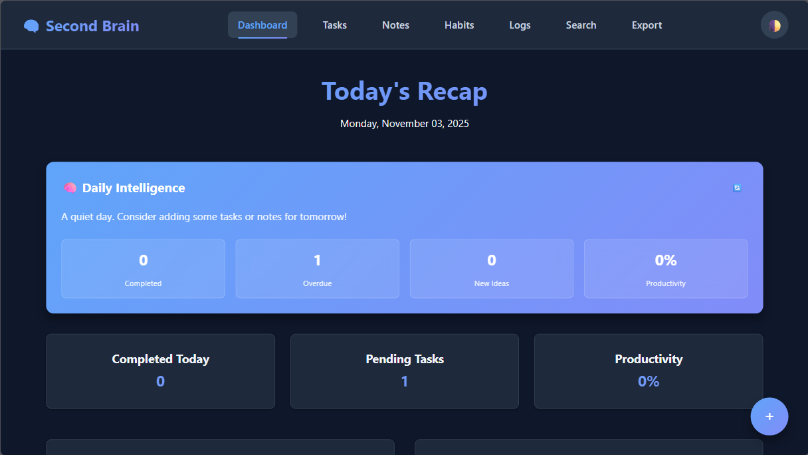

# ⚡ Axon — Personal Memory & Productivity OS

> A full-stack productivity app built with a **DevOps-first mindset** — containerized, CI/CD-automated, offline-capable, and production-ready.
> 


---

## 📌 What Is This?

Axon is a personal productivity app — tasks, notes, habits, and daily logs in one interface. But the app itself is secondary. This project exists to demonstrate **end-to-end DevOps practices**: containerization, automated pipelines, offline-first data strategy, and clean deployment patterns.

---

## 🏗️ Architecture Overview

```
┌─────────────────────────────────────────────────────────┐
│                        CLIENT                           │
│  ┌──────────────┐   ┌──────────────┐  ┌─────────────┐  │
│  │  Vanilla JS  │   │ Service Worker│  │  localStorage│  │
│  │  (modules)   │   │ (cache layer) │  │  (fallback) │  │
│  └──────┬───────┘   └──────┬───────┘  └──────┬──────┘  │
│         └──────────────────┴─────────────────┘          │
│                       fetch() interceptor                │
└─────────────────────────────┬───────────────────────────┘
                               │ REST / JSON
┌─────────────────────────────▼───────────────────────────┐
│                     FLASK + GUNICORN                     │
│   /api/tasks   /api/notes   /api/habits   /api/logs      │
│                    SQLAlchemy ORM                        │
│                    SQLite / PostgreSQL                   │
└─────────────────────────────────────────────────────────┘

┌─────────────────────────────────────────────────────────┐
│                   DEPLOYMENT STACK                      │
│   GitHub Actions → ghcr.io → Docker → VPS / Cloud      │
└─────────────────────────────────────────────────────────┘
```

---

## 🚀 DevOps Highlights

### 1. Multi-Stage Docker Build
The Dockerfile uses a **two-stage build** to keep the final image lean and secure:

```dockerfile
# Stage 1 — builder: compiles dependencies
FROM python:3.11-slim AS builder
RUN pip install --prefix=/install -r requirements.txt

# Stage 2 — runtime: copies only what's needed
FROM python:3.11-slim AS runtime
COPY --from=builder /install /usr/local
```

- Final image contains **no build tools** (gcc, pip cache, etc.)
- Runs as a **non-root user** (`axon`) — principle of least privilege
- Built-in **health check** on `/health` endpoint for container orchestrators

### 2. GitHub Actions CI/CD Pipeline

Every push to `main` triggers a **3-job pipeline**:

```
push to main
     │
     ▼
┌─────────┐     ┌───────────────┐     ┌─────────────────┐
│  🧪 Test │────▶│ 🐳 Build+Push │────▶│ 🚀 Deploy (opt) │
│  flake8  │     │  ghcr.io tag  │     │  SSH to VPS     │
│  pytest  │     │  sha + latest │     │  docker compose │
└─────────┘     └───────────────┘     └─────────────────┘
```

- **Test job**: flake8 lint (syntax errors block the build), pytest with smoke test fallback
- **Build job**: Docker Buildx with **GitHub Actions cache** (`cache-from/to: type=gha`) — faster rebuilds
- **Image tagging**: `latest` + short SHA (`sha-abc1234`) for traceability and rollbacks
- **Registry**: GitHub Container Registry (`ghcr.io`) — no external registry needed

### 3. Offline-First Data Strategy

The frontend uses a custom **fetch() interceptor** (`storage.js`) that implements a graceful degradation pattern:

```
Request comes in
      │
      ▼
 Server reachable? ──YES──▶ Use Flask API (SQLite)
      │
      NO
      ▼
 localStorage fallback ──▶ Full CRUD with local UIDs
      │
      ▼
 Server comes back? ──YES──▶ AxonSync() pushes local records up
```

No changes to any existing JS files — the interceptor is transparent to the rest of the codebase.

### 4. PWA with Service Worker

- Static assets cached on install via `sw.js`
- API routes use **network-first** strategy with cache fallback
- App is installable on desktop and mobile (manifest.json)
- Service worker **auto-disables on localhost** — no stale cache during development

---

## 🛠️ Tech Stack

| Layer | Technology | Why |
|---|---|---|
| Backend | Flask 2.x + Gunicorn | Lightweight WSGI, easy to containerize |
| ORM | SQLAlchemy | DB-agnostic (SQLite dev, PostgreSQL prod) |
| Frontend | Vanilla JS (ES6 modules) | Zero build step, minimal footprint |
| Styling | CSS custom properties | Theme switching without JS frameworks |
| Container | Docker (multi-stage) | Reproducible, minimal runtime image |
| Registry | GitHub Container Registry | Free, integrated with Actions |
| CI/CD | GitHub Actions | Native to repo, no external tools |
| Offline | Service Worker + localStorage | Works fully without a server |
| Server | Gunicorn (Linux) / Waitress (Windows) | Production-grade WSGI |

---

## 📁 Project Structure

```
axon/
├── .github/
│   └── workflows/
│       └── ci-cd.yml          # CI/CD pipeline (test → build → deploy)
├── database/
│   ├── init_db.py             # DB initialization script
│   └── schema.sql             # Raw schema (used for reference/migrations)
├── static/
│   ├── css/
│   │   └── style.css          # Full design system (CSS variables, responsive)
│   ├── js/
│   │   ├── storage.js         # ⭐ fetch() interceptor + localStorage fallback
│   │   ├── main.js            # Theme, notifications, keyboard shortcuts
│   │   ├── tasks.js           # Task CRUD module
│   │   ├── notes.js           # Notes CRUD module
│   │   ├── habits.js          # Habit tracker module
│   │   └── logs.js            # Daily log module
│   ├── manifest.json          # PWA manifest
│   └── sw.js                  # Service worker (cache strategy)
├── templates/
│   ├── base.html              # Layout shell (sidebar, topbar, bottom nav)
│   ├── index.html             # Dashboard
│   ├── tasks.html
│   ├── notes.html
│   ├── habits.html
│   ├── logs.html
│   ├── search.html
│   └── export.html
├── app.py                     # Flask app, models, all API routes
├── config.py                  # Environment-based configuration
├── gunicorn.conf.py           # Gunicorn worker config
├── production.py              # Waitress entry point (Windows)
├── Dockerfile                 # Multi-stage production image
├── docker-compose.yml         # Local full-stack setup
└── requirements.txt
```

---

## ⚡ Quick Start

### Option A — Local Python

```bash
git clone https://github.com/yourusername/axon.git
cd axon

pip install -r requirements.txt
python app.py
# → http://localhost:5000
```

### Option B — Docker (recommended)

```bash
# Build and run
docker build -t axon .
docker run -p 5000:5000 -v axon_data:/app/instance axon

# Or with Compose
docker compose up -d
```

### Option C — Run without a server

Just open `index.html` in a browser. `storage.js` detects the server is unreachable and switches to localStorage automatically. All features work.

---

## 🔁 CI/CD Pipeline — Step by Step

```bash
# 1. Push to main
git push origin main

# 2. GitHub Actions triggers automatically:
#    ✅ flake8 lint
#    ✅ Database smoke test
#    ✅ pytest (if tests/ exists)
#    🐳 docker buildx build --platform linux/amd64
#    📦 push to ghcr.io/yourname/axon:latest
#         and ghcr.io/yourname/axon:sha-abc1234

# 3. Pull the image anywhere
docker pull ghcr.io/yourusername/axon:latest
docker run -p 5000:5000 ghcr.io/yourusername/axon:latest
```

---

## 🌐 API Reference

All endpoints return JSON. No authentication required (single-user app).

```
Tasks
  GET    /api/tasks              List all tasks
  POST   /api/tasks              Create task  { title, description, due_date }
  GET    /api/tasks/:id          Get one task
  PUT    /api/tasks/:id          Update task
  DELETE /api/tasks/:id          Delete task

Notes
  GET    /api/notes              List all notes
  POST   /api/notes              Create note  { content, tags }
  PUT    /api/notes/:id          Update note
  DELETE /api/notes/:id          Delete note

Habits
  GET    /api/habits             List habits with streak data
  POST   /api/habits/:id/complete  Mark complete (updates streak)
  POST   /api/habits/:id/skip      Skip today

Logs
  GET    /api/logs/today         Get today's log
  POST   /api/logs               Create log  { accomplishments, missed_items, tomorrow_plan }
  PUT    /api/logs/:id           Update log
  DELETE /api/logs/:id           Delete log

System
  GET    /health                 { status, timestamp, version }
  GET    /api/daily-recap        Computed productivity summary
  GET    /api/export/csv         Download all data as CSV
  GET    /api/export/json        Download all data as JSON
```

---

## 🔧 Environment Variables

```bash
SECRET_KEY=your-secret-key-here        # Flask session signing key
DATABASE_URL=sqlite:///second_brain.db  # Swap to postgresql://... for prod
FLASK_ENV=development                   # or production
PORT=5000
```

---

## 🐳 Docker Details

```bash
# Build only
docker build -t axon:local .

# Run with persistent SQLite volume
docker run -d \
  --name axon \
  -p 5000:5000 \
  -v axon_db:/app/instance \
  -e SECRET_KEY=change-me \
  axon:local

# Check health
docker inspect --format='{{.State.Health.Status}}' axon

# View logs
docker logs -f axon
```

---

## 🗺️ Roadmap

- [ ] PostgreSQL support via `DATABASE_URL` env var
- [ ] Multi-user auth (Flask-Login)
- [ ] Kubernetes manifests (Deployment + Service + PVC)
- [ ] Prometheus `/metrics` endpoint
- [ ] Automated database migrations (Alembic)
- [ ] End-to-end tests with Playwright

